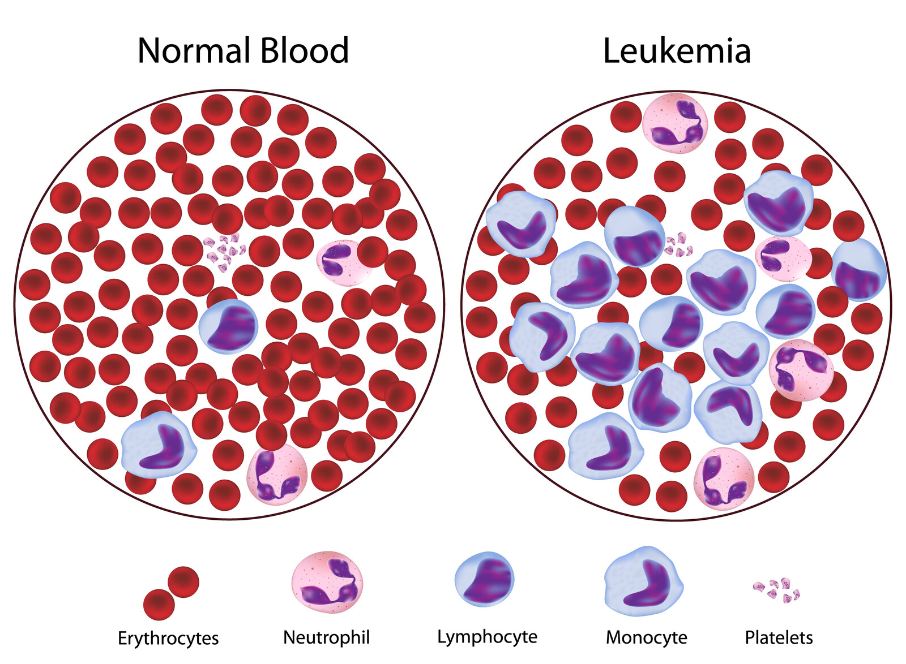
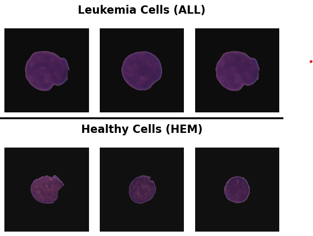
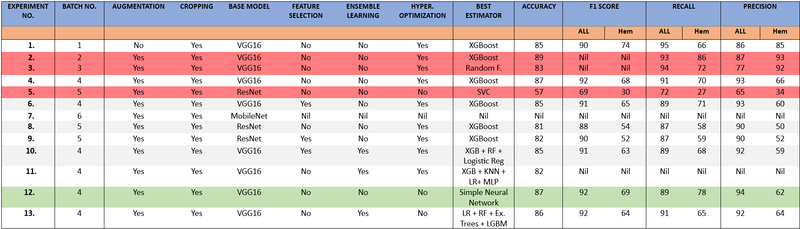
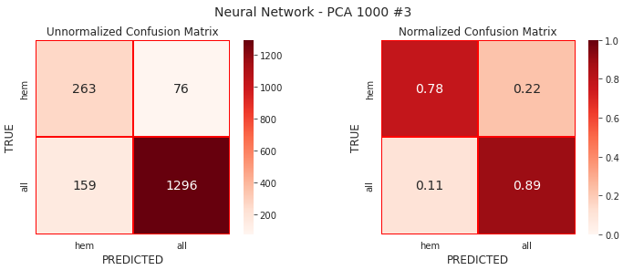
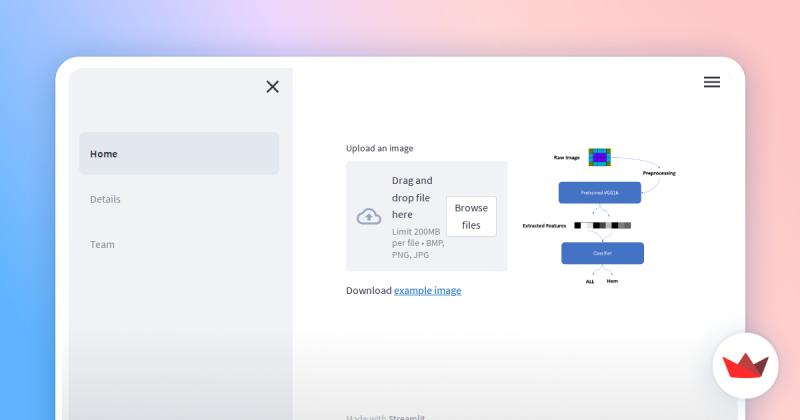

# Detecting Pediatric Acute Lymphoblastic Leukemia using Computer Vision

[This project](https://omdena.com/chapter-challenges/detecting-pediatric-acute-lymphoblastic-leukemia-using-computer-vision/) is a collaborative open source AI project ran by Omdena Liverpool Chapter with all collaborations in the [project GitHub repo](https://github.com/OmdenaAI/liverpool-chapter-detecting-pediatric-acute).

## Background

Leukemia is a condition in which the body produces an excessive amount of dysfunctional blood cells of a specific type. These abnormal cells, predominantly white blood cells, fail to mature and exhibit distinct characteristics from normal blood cells. Leukemia encompasses various types that are primarily classified based on the speed of growth (acute or chronic) and whether it originates from myeloid cells or lymphoid cells.

In Acute Lymphoblastic Leukemia (ALL), an excessive buildup of immature lymphocyte precursor cells known as blast cells occurs within the bone marrow. This accumulation ultimately hampers the production of healthy blood cells, leading to a decrease in red blood cells, normal white blood cells, and platelets within the bloodstream.

<figure>
 
<figcaption><i>© Can Stock Photo / alila</i></figcaption>
</figure>

Acute Lymphoblastic Leukemia (ALL) is the sole type of leukemia that exhibits a higher incidence in children compared to adults. It stands as the most prevalent form of cancer among pediatric patients, comprising approximately one-third of all cases in children. Approximately 85% of childhood leukemia cases are classified as ALL, with around 400 children being affected by it annually in the UK. The onset of ALL primarily occurs between the ages of two and four years. Additionally, males are more commonly affected by ALL than females across all age groups.

Distinguishing between immature leukemic blasts and normal cells under a microscope poses a challenging task due to their morphological similarities. This similarity often leads to time-consuming and costly diagnoses.

## Objective

The objective of the project is to develop a model that enables prompt and cost-effective early identification of pediatric Acute Lymphoblastic Leukemia (ALL). This advancement aims to facilitate timely initiation of treatment, potentially saving the lives of affected individuals.

In more precise terms, the objective is to utilize machine learning and deep learning techniques to train models capable of automatically identifying and classifying healthy cells (hem) and cancer cells (ALL).

## Data

The dataset for the project: [ALL Challenge dataset of ISBI 2019 (C-NMC 2019)](https://wiki.cancerimagingarchive.net/pages/viewpage.action?pageId=52758223)

Challenge is split into 3 separate phases:

- **Train set composition:**
  - Total subjects: 73, ALL (cancer): 47, Normal: 26
  - Total cell images: 10,661, ALL(cancer): 7272, Normal: 3389
- **Preliminary test set composition:**
  - Total subjects: 28, ALL (cancer): 13, Normal: 15
  - Total cell images: 1867, ALL(cancer): 1219, Normal: 648
- **Final test set composition:**
  - Total subjects: 17, ALL (cancer): 9, Normal: 8
  - Total cell images: 2586

 

## Modelling

Developing of the model was accomplished through several steps:

### 1. Image Preprocessing

- Image **augmentation** and **cropping** was used to preprocess images.

### 2. Feature Extraction

- **Transfer learning** was performed using pre-trained models (ResNet101, VGG16) to extract features from images.

### 3. Classification

- The extracted features were used to train traditional machine learning algorithms

### 4. Experimentation

- Numerous experiments with slightly different approaches were conducted by the team:

<figure>

<figcaption><i>Credit: experiments.png by Owais Tahir</i></figcaption>
</figure>

### 5. Deployment

- The best performing model was a simple neural network (SciKeras Classifier) with 2 hidden layers that outperformed traditional machine learning models:

 

-  To effortlessly classify new cell images, the Streamlit web app was deployed. Click the image below to start the app:

  

## My Contribution

I contributed to the project by training traditional machine learning models on the image features extracted by transfer learning with VGG16 CNN model (batch_4 dataset).

Algorithms and techniques used:

1. ### Classifiers

   - XGBoost, K-nearest neighbors, SVM, Random Forest
   - Stacking  Classifier
     - *Base estimators:* K-nearest neighbors, SVM, Random Forest, Logistic Regression, Gaussian Naïve Bayes, Multi-layer Perceptron, Extra Trees
     - *Final estimator:* XGBoost
   - A simple neural network using SciKeras (Scikit-Learn API wrapper for Keras) Classifier

2. ### Feature selection

   - PCA
   - ANOVA

3. ### Hyperparameter  tuning

   - RandomizedSearchCV 
   - Optuna

4. ### Evaluation Metrics

   - F1-score
   - macro-averaged F1-score

   

More details and results can be found in the [README.md](notebooks/README.md) in the notebooks folder. 

The slides in [Pediatric ALL Challenge - My Experience.pdf](docs/Pediatric%20ALL%20Challenge%20-%20My%20Experience.pdf) present some of my reflections on the project, including challenges and obstacles I faced.

