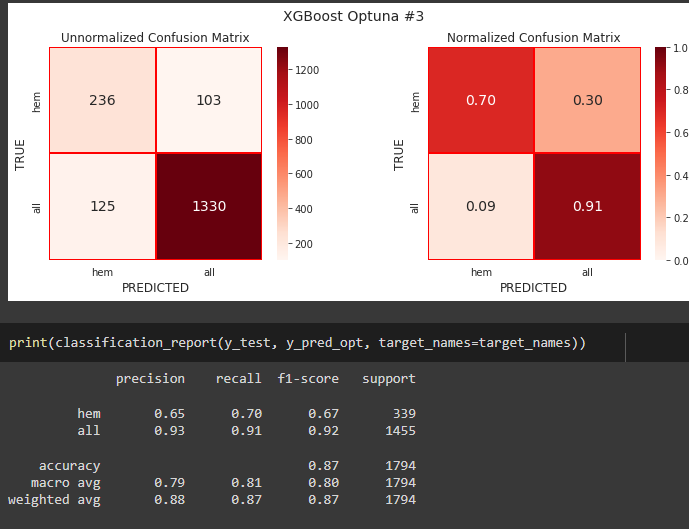
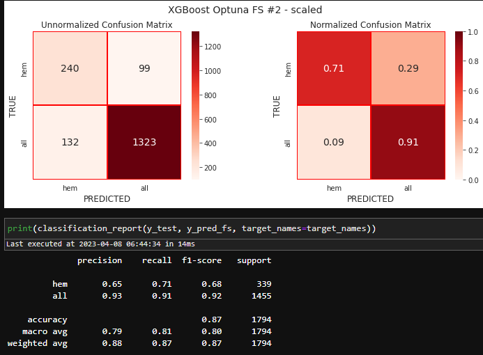
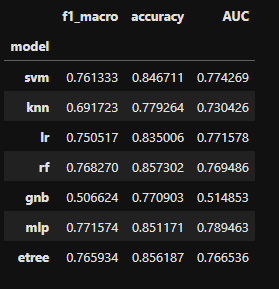
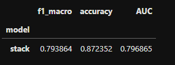
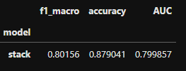
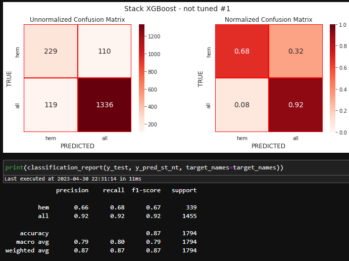
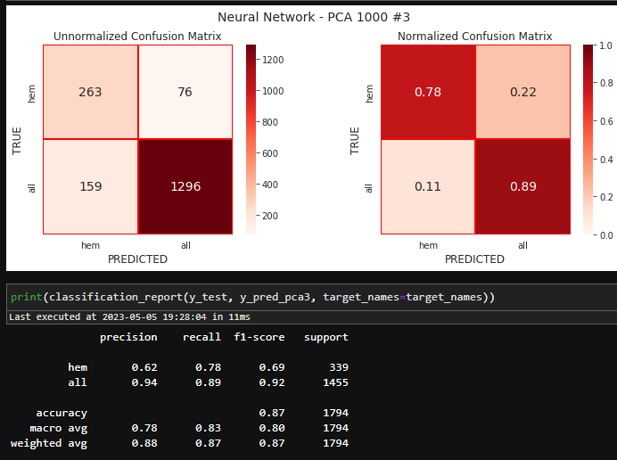

# Detecting Pediatric Acute Lymphoblastic Leukemia (ALL)

Our task was to use previously extracted features from cell images and try to classify them as ALL or normal.

 After testing several machine algorithms:

- K-nearest neighbors
- SVM
- Random Forest
- XGBoost

 I decided to use XGBoost in majority of the experiments.

## XGBoost with Optuna

In the notebook [Leukemia modelling - xgb_opt - batch_4.ipynb](Leukemia%20modelling%20-%20xgb_opt%20-%20batch_4.ipynb) I was using Optuna to tune XGBoost's hyperparameters. I was experimenting with different parameter spaces for Optuna optimization. f1_score was used as the metrics to find the best trial.

Parameter spaces #3 and #4 resulted in two best performing models in this notebook:

## XGBoost and feature selection - ANOVA

The subject of the notebook  [Leukemia modelling - xgb_opt_fs - batch_4.ipynb](https://github.com/OmdenaAI/liverpool-chapter-detecting-pediatric-acute/blob/main/src/tasks/team-1/Damir-Zunic/Leukemia%20modelling%20-%20xgb_opt_fs%20-%20batch_4.ipynb) was to select K-best features with ANOVA and use XGBoost as the classifier. The parameter K (number of top features to select) was added to the parameter space together with XGBoost parameters. As in the previous notebook, I was changing Optuna parameter spaces. The metrics that we used to find the best trial was again f1_score. 

The best performing model was result of optimizing the parameter space #2 and using MinMaxScaler to preprocess data.

## Stacking with XGBoost as meta classifier

The notebook [Leukemia modelling - xgb_opt_ens - batch_4.ipynb](https://github.com/OmdenaAI/liverpool-chapter-detecting-pediatric-acute/blob/main/src/tasks/team-1/Damir-Zunic/Leukemia%20modelling%20-%20xgb_opt_ens%20-%20batch_4.ipynb) covers Stacking Classifier, with XGBoost as a meta classifier and the following base estimators:

- K-nearest neighbors
- SVM
- Random Forest
- Logistic Regression
- Gaussian Naive Bayes
- Multi-layer Perceptron
- Extra Trees

The performed steps:

1. Each base estimator was optimized with Optuna to find the best hyperparameters

     

2. Two worst performers, K-nearest neighbors and Gaussian Naïve Bayes, were dropped

3. Stacking classifier was ran using remaining tuned estimators and XGBoost with default parameters. The performance was recorded.

    

4. Optuna was used to optimize the stacking classifier. Optuna's parameter space included the final estimator (XGBoost) parameters.

    

This time we used macro averaged f1_score as the metrics to find the best Optuna's trial.

## Neural Network with Optuna

In the notebook [Leukemia modelling - neural_network - batch_4.ipynb](https://github.com/OmdenaAI/liverpool-chapter-detecting-pediatric-acute/blob/main/src/tasks/team-1/Damir-Zunic/Leukemia%20modelling%20-%20neural_network%20-%20batch_4.ipynb)  I experimented with neural networks with 1 - 3 hidden layers.

I used [SciKeras](https://pypi.org/project/scikeras/#description), a Scikit-Learn API wrapper for Keras. 

First we atarted with base models:

- KerasClassifier only

- pipeline with MinMaxScaler, PCA and KerasClassifier

In the rest of the notebook we used Optuna to tune hyperparameters in the pipeline. We also tried feature selection with ANOVA, but with no success.

We used PCA with a fixed number of components (N_components=1000) and with `n_components` as a parameter in Optuna optimization process.

Macro averaged f1_score was used as the metrics to find the best Optuna's trial.

At the very end of the notebook, four best models are displayed. The best model is nn_pca_3. 

This is also the best model among all my experiments:

**NOTE:**

 - SciKeras 10.0.0 requires Python <3.11
 - Due to some problems with GPU, I had to downgrade TensorFlow to 2.10
 - This version of SciKeras requires slightly different procedure to save/load pipelined models. Check this in the chapter *The Best Models*.
 - How to load a pipelined model is described in the notebook [Leukemia modelling - the best model nn_pca_3.ipynb](https://github.com/OmdenaAI/liverpool-chapter-detecting-pediatric-acute/blob/main/src/tasks/team-1/Damir-Zunic/Leukemia%20modelling%20-%20the%20best%20model%20nn_pca_3.ipynb).

